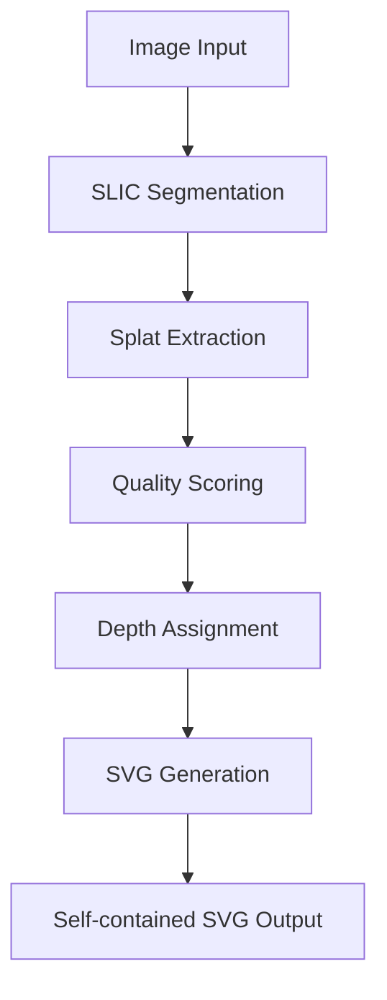

# Technical Implementation Specification

**Parent Spec:** @../spec.md
**Created:** 2025-01-20
**Version:** 1.0.0

## Implementation Architecture

### Core Pipeline Flow



### Module Specifications

#### 1. Image Loading Module (`utils.py`)

```python
def load_image(path: str, frame: int = 0) -> np.ndarray:
    """Load and validate image from file path."""

def validate_image_format(path: str) -> bool:
    """Verify supported format (PNG/JPG/GIF)."""

def extract_gif_frame(path: str, frame: int) -> np.ndarray:
    """Extract specific frame from GIF."""
```

**Implementation Details:**
- Use PIL for robust image loading
- Convert all inputs to RGB numpy arrays
- Handle EXIF orientation data
- Implement memory-efficient GIF frame extraction
- Validate image dimensions (min 100x100, max 8192x8192)

#### 2. SLIC Segmentation Module (`extract.py`)

```python
def extract_splats(image: np.ndarray, n_splats: int, k: float = 2.5) -> List[Gaussian]:
    """Extract Gaussian splats from image using SLIC superpixels."""

def compute_superpixels(image: np.ndarray, n_segments: int) -> np.ndarray:
    """Generate SLIC superpixel segmentation."""

def analyze_region_covariance(image: np.ndarray, mask: np.ndarray) -> Tuple[float, float, float]:
    """Compute covariance matrix for region to determine splat parameters."""
```

**Algorithm Details:**

1. **SLIC Parameters:**
   - `n_segments`: Start with 1.5x target splat count for filtering
   - `compactness`: 10 (balanced shape vs color)
   - `sigma`: 1.0 for pre-smoothing
   - `multichannel`: True for RGB processing

2. **Covariance Analysis:**
   ```python
   # For each superpixel region:
   # 1. Extract pixel coordinates and weights
   coords = np.column_stack(np.where(mask))
   weights = image[mask].mean(axis=1)  # luminance weighting

   # 2. Compute weighted covariance matrix
   cov_matrix = np.cov(coords.T, aweights=weights)

   # 3. Eigenvalue decomposition for ellipse parameters
   eigenvals, eigenvecs = np.linalg.eigh(cov_matrix)
   rx, ry = k * np.sqrt(eigenvals)
   theta = np.arctan2(eigenvecs[1, 0], eigenvecs[0, 0])
   ```

3. **Color Extraction:**
   ```python
   # Mean color with alpha from local contrast
   rgb = image[mask].mean(axis=0).astype(int)
   local_variance = image[mask].var()
   alpha = base_alpha * min(1.0, local_variance / variance_threshold)
   ```

#### 3. Depth Scoring Module (`layering.py`)

```python
def assign_depth_layers(splats: List[Gaussian], n_layers: int) -> Dict[int, List[Gaussian]]:
    """Assign splats to depth layers based on importance scoring."""

def compute_importance_score(splat: Gaussian, image: np.ndarray) -> float:
    """Calculate importance score for depth assignment."""

def quantize_depth_layers(scores: np.ndarray, n_layers: int) -> np.ndarray:
    """Map continuous scores to discrete layer indices."""
```

**Scoring Algorithm:**
```python
def compute_importance_score(splat: Gaussian, image: np.ndarray) -> float:
    # Extract region around splat
    x, y, rx, ry = int(splat.x), int(splat.y), int(splat.rx), int(splat.ry)
    region = image[max(0, y-ry):y+ry+1, max(0, x-rx):x+rx+1]

    # Calculate components
    area_score = (rx * ry) / (image.shape[0] * image.shape[1])  # Normalized area
    edge_strength = cv2.Laplacian(region, cv2.CV_64F).var()     # Edge variance
    color_variance = region.var()                               # Color complexity

    # Combined score with weighting
    return area_score * 0.3 + edge_strength * 0.5 + color_variance * 0.2
```

**Layer Assignment:**
- Use percentile-based quantization for consistent distribution
- Map layer indices to depth values: `depth = 0.2 + (layer / (n_layers - 1)) * 0.8`
- Ensure minimum/maximum splats per layer for visual balance

#### 4. SVG Generation Module (`svgout.py`)

```python
def generate_svg(layer_data: Dict[int, List[Gaussian]],
                width: int, height: int,
                parallax_strength: int = 40,
                gaussian_mode: bool = False) -> str:
    """Generate complete SVG with inline animation."""

def render_splat_layer(splats: List[Gaussian], depth: float, gaussian_mode: bool) -> str:
    """Render single depth layer with splats."""

def generate_animation_script(parallax_strength: int) -> str:
    """Generate inline JavaScript for parallax interaction."""
```

**SVG Structure:**
```xml
<svg viewBox="0 0 {width} {height}"
     color-interpolation="linearRGB"
     style="width: 100%; height: 100vh;">

  <!-- Optional shared gradient definition -->
  <defs>
    <radialGradient id="splat-gradient" cx="50%" cy="50%" r="50%">
      <stop offset="0%" stop-opacity="1"/>
      <stop offset="100%" stop-opacity="0"/>
    </radialGradient>
  </defs>

  <!-- Layer groups -->
  <g class="layer" data-depth="0.2">
    <!-- Background splats -->
  </g>
  <g class="layer" data-depth="0.6">
    <!-- Midground splats -->
  </g>
  <g class="layer" data-depth="1.0">
    <!-- Foreground splats -->
  </g>

  <!-- Inline CSS and JavaScript -->
  <style>/* Animation styles */</style>
  <script>/* Parallax interaction */</script>
</svg>
```

**Animation Implementation:**
```css
.layer {
  transform-style: preserve-3d;
  transition: transform 0.1s ease-out;
}

@media (prefers-reduced-motion: reduce) {
  .layer { transition: none !important; }
}
```

```javascript
// Parallax interaction with gyroscope support
let mouseX = 0, mouseY = 0;
const strength = {parallax_strength};

function updateParallax() {
  document.querySelectorAll('.layer').forEach(layer => {
    const depth = parseFloat(layer.dataset.depth);
    const offsetX = (mouseX - 0.5) * strength * depth;
    const offsetY = (mouseY - 0.5) * strength * depth;
    layer.style.transform = `translate(${offsetX}px, ${offsetY}px) scale(${1 + depth * 0.02})`;
  });
}

// Mouse tracking
document.addEventListener('mousemove', e => {
  mouseX = e.clientX / window.innerWidth;
  mouseY = e.clientY / window.innerHeight;
  updateParallax();
});

// Gyroscope support for mobile
if (window.DeviceOrientationEvent) {
  window.addEventListener('deviceorientation', e => {
    mouseX = 0.5 + (e.gamma || 0) / 90;
    mouseY = 0.5 + (e.beta || 0) / 180;
    updateParallax();
  });
}
```

### Performance Optimizations

#### Memory Management
- Process images in chunks for large inputs
- Use in-place operations where possible
- Clear intermediate arrays after processing
- Implement optional downscaling for memory-constrained environments

#### Computational Efficiency
- Vectorized operations with NumPy
- Parallel processing for independent splat calculations
- Efficient spatial indexing for region queries
- Caching for repeated calculations

#### Output Optimization
- Numerical precision limiting (3 decimal places)
- Redundant attribute removal
- Efficient string building for SVG generation
- Optional compression for development builds

### Error Handling Strategy

#### Input Validation
```python
class SplatError(Exception):
    """Base exception for SplatThis operations."""

class ImageFormatError(SplatError):
    """Unsupported or corrupted image format."""

class ParameterError(SplatError):
    """Invalid CLI parameter values."""
```

#### Graceful Degradation
- Reduce splat count if memory constrained
- Fall back to simpler algorithms for edge cases
- Provide meaningful progress feedback
- Implement timeout protection for long operations

### Testing Strategy

#### Unit Tests
- Image loading with various formats and edge cases
- SLIC segmentation parameter validation
- Mathematical correctness of covariance calculations
- SVG generation and template rendering
- Animation script generation

#### Integration Tests
- End-to-end pipeline with reference images
- Performance benchmarking across image sizes
- Cross-platform compatibility validation
- Browser compatibility testing for generated SVGs

#### Property-Based Testing
- Fuzz testing with random image inputs
- Parameter boundary testing
- Memory usage validation
- Output format compliance verification

### Dependencies and Version Management

#### Core Dependencies
```python
# requirements.txt
Pillow>=9.0.0,<11.0.0        # Image processing
numpy>=1.21.0,<2.0.0         # Numerical computations
scikit-image>=0.19.0,<1.0.0  # SLIC segmentation
click>=8.0.0,<9.0.0          # CLI framework
```

#### Development Dependencies
```python
# requirements-dev.txt
pytest>=7.0.0
black>=22.0.0
mypy>=0.991
coverage>=6.0.0
```

### Deployment Considerations

#### Package Structure
```
splat_this/
├── __init__.py
├── cli.py           # Entry point
├── core/
│   ├── __init__.py
│   ├── extract.py   # Splat extraction
│   ├── layering.py  # Depth assignment
│   └── svgout.py    # SVG generation
├── utils/
│   ├── __init__.py
│   ├── image.py     # Image utilities
│   └── math.py      # Mathematical helpers
└── templates/
    └── svg_base.xml # SVG template
```

#### Entry Point Configuration
```python
# setup.py or pyproject.toml
[project.scripts]
splatlify = "splat_this.cli:main"
```

### Security Considerations

#### Input Sanitization
- Validate file extensions and MIME types
- Implement file size limits (default: 50MB)
- Prevent path traversal in output file specification
- Safe handling of potentially malicious image files

#### Output Safety
- SVG sanitization to prevent XSS
- No external resource references
- Safe JavaScript generation without eval()
- Validation of numerical outputs to prevent overflow