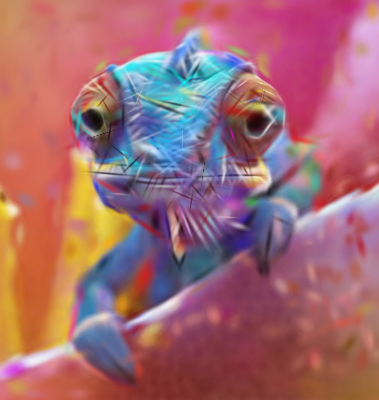

# SplatThis

Image to SVG, native PowerPoint, or self-contained HTML Canvas via 2D Gaussian
splatting.

SplatThis fits anisotropic 2D Gaussians to a bitmap and deploys the result in
three different compositors:

- **Canvas HTML** reproduces the trained alpha-over model most closely and can
  add layered mouse parallax.
- **SVG** emits real vector gradients or blur primitives that remain editable.
- **PPTX** emits native DrawingML shapes, not a PNG disguised as a slide.

These formats are not interchangeable. SVG and PowerPoint composite shapes
differently from the linear-light Canvas runtime, so training and evaluation
are target-aware.

## Gallery

| Source | Canvas capture | SVG rasterization |
|---|---|---|
|  |  |  |

Example artifacts:
[chameleon.svg](docs/demo/chameleon.svg) and
[canvas.html](docs/demo/canvas.html).
The development history is recorded in [docs/journey](docs/journey/).

## Install

Python 3.13 or newer is required.

```bash
git clone https://github.com/BramAlkema/SplatThis.git
cd SplatThis
python3.13 -m venv venv
source venv/bin/activate
pip install -e ".[dev,rasterize,capture]"
```

The `capture` extra supplies Playwright for exact Canvas screenshots using an
installed Google Chrome; it does not require the sibling `svg2pptx` project.

On Apple Silicon, install the optional MLX backend:

```bash
pip install -e ".[mlx]"
```

If MLX is absent, or the process has no Metal device, `splatlify` falls back to
Torch before training starts. Use `--optimizer-backend torch` explicitly for
CPU or CUDA runs.

## Quick start

```bash
# Highest-fidelity deploy target; self-contained HTML.
splatlify input.png -o output.html --format canvas \
  --splats 4000 --initial-splat-cap 4000

# Optional: stop later Canvas stages once this run reaches the desired Chrome target.
splatlify input.png -o output.html --format canvas \
  --splats 4000 --initial-splat-cap 4000 \
  --adaptive-compute --adaptive-target-ssim-srgb 0.98

# Static editable SVG, trained for the SVG compositor.
splatlify input.png -o output.svg --format svg --splats 2000

# Native editable PowerPoint shapes. Gradient is the conservative default.
splatlify input.png -o output.pptx --format pptx \
  --pptx-splat-style gradient --splats 2000
```

`--training-export-target auto` is the default. It resolves to `svg` for SVG
and to `canvas` for Canvas and PPTX. Use `pptx-softedge` only when deliberately
training for the real-PowerPoint soft-edge primitive; it may look washed out in
other viewers.

## Full-corpus results

The table below uses all 21 stored corpus images at a maximum edge of roughly
384 px, seed 0. Canvas is scored from the exact Chrome canvas pixel buffer,
SVG from the emitted and rasterized SVG, and PPTX from Microsoft PowerPoint
slideshow captures. Values are medians, not a claim about every picture.

| Deployed artifact | Budget | Final splats | SSIM ↑ | LPIPS ↓ | Size | Training |
|---|---:|---:|---:|---:|---:|---:|
| Canvas HTML | requested 2k | 1,395 | 0.7751 | 0.2443 | 226 KB | 3.6 min |
| Canvas HTML | effective 4k | 2,382 | 0.8406 | 0.1612 | 391 KB | 9.9 min |
| SVG | requested 2k | 1,389 | 0.6022 | 0.4002 | 765 KB | 4.2 min |
| PowerPoint | requested 2k | 1,374 | 0.6091 | 0.3843 | 127 KB | 6.6 min |

Effective-4k Canvas rendered in a median 105 ms in the capture browser. All 21
images improved in both SSIM and LPIPS over requested-2k, but none reached
0.99 SSIM. Chameleon improves from 0.9140 at 2k to 0.9438 at effective 4k and
0.9631 at effective 8k. The project therefore does not promise near-0.99
fidelity at small budgets.

See [the Canvas scaling MVP](docs/canvas-scaling-mvp.md) for paired per-image
statistics and [the format findings](docs/SVG_PPTX_GAUSSIAN_TRICKS.md) for the
SVG and PowerPoint compositor analysis.

If editability, target-specific animation, or the splat representation is not
needed, a normal PNG/JPEG is usually smaller and more faithful. SplatThis is
useful when those document-native properties matter.

## Recommended use

| Target | Practical starting point | Main trade-off |
|---|---|---|
| Canvas | 2k for speed, effective 4k for quality | Best fidelity; JS runtime and browser work |
| SVG | 1k-2k, `standard` recipe | Fully editable; compositor imposes a visible ceiling |
| PPTX | 1k-2k, `gradient` style | Native shapes; viewer-specific rendering |

More splats help Canvas when the initialization population is also allowed to
grow. A nominal `--splats 4000` with a low initial cap is not an effective 4k
experiment.

Layered Canvas parallax is available with:

```bash
splatlify input.png -o parallax.html --format canvas \
  --layered-saliency --canvas-parallax-strength 28
```

Mouse-over or grid-triggered PowerPoint parallax is documented as an MVP idea;
it is not part of the released PPTX exporter.

## How it works

1. Content-adaptive initialization places splats where the image needs them.
2. Torch or MLX optimizes position, scale, rotation, color, and alpha.
3. Progressive densification adds detail while pruning low-impact splats.
4. Target-aware post-fit stages approximate the deploy compositor.
5. Monotonic gates retain a candidate only when deployed-model quality holds.
6. SVG, Canvas, or native DrawingML is written atomically.

The MLX renderer default is eight tiles per batch. On Chameleon, Retina, and
Grass checkpoints this reduced median forward-and-backward latency by 12-34%
versus a 16-tile batch; the Chameleon converter-default comparison was 23%
faster than 128 tiles. Render math is unchanged. The emitted Canvas and corpus
overview also avoid repeated browser-side sorting; the overview lazily renders
cards near the viewport.

## Important flags

| Flag | Meaning |
|---|---|
| `--format {svg,pptx,canvas}` | Output container and compositor |
| `--training-export-target {auto,canvas,svg,pptx-softedge}` | Optimization target |
| `--optimizer-backend {mlx,torch}` | Optimizer implementation |
| `--splats N` | Maximum splat population |
| `--initial-splat-cap N` | Initial population ceiling |
| `--stages a,b,c` | Per-stage iteration schedule |
| `--svg-recipe {standard,blur,palette-quantized,...}` | SVG primitive family |
| `--pptx-splat-style {gradient,soft-edge,blur}` | DrawingML primitive family |
| `--fidelity-stage {off,balanced,max}` | Accept-or-revert SVG artifact polish |
| `--adaptive-compute` | Default-off Canvas hard-target early stopping |
| `--adaptive-target-ssim-srgb X` | Desired Chrome SSIM, scored with the byte-exact runtime model |
| `--artifacts-dir DIR` | Manifest and stage checkpoints |

Top-K distillation and mixed primitives live in experimental modules and MVP
tools. They are not default release paths because their gains are not yet
robust across the full corpus.

Artifact-repeat noise has been calibrated over all 21 images for Chrome
Canvas, `rsvg-convert`, and real Microsoft PowerPoint. The versioned floors
live in `data/artifact-gates.json`. Canvas also has a default-off online
controller that can skip later stages after an observed checkpoint reaches an
explicit Chrome quality target. Its deployed scorer now mirrors JavaScript
double math, Float32Array accumulation, and 8-bit sRGB ImageData packing. All
48 browser-captured full-frame checkpoints were byte-for-byte identical to
Chrome, eliminating the former `0.001102` continuous-model overstatement and
the need for a default safety margin. It does not predict higher budgets or
stop on a plateau. An exact replay then rescored all 84 raw checkpoints across
all 21 images. Targets 0.98 and 0.979 both stopped only Brick and Colorwheel and
saved 1.3% of aggregate stage time with zero observed opportunity cost, below
the 5% gate for further hard-target A/B expansion. The earlier single
Colorwheel arm that saved 27% remains mechanism evidence, not the governing
speed claim. See
[artifact gates and adaptive compute](docs/artifact-gates-and-adaptive-compute.md).

## Development and release verification

```bash
source venv/bin/activate
isort --check-only src tests tools
black --check src tests tools
flake8 src tests tools
pytest tests/unit --cov=src/png2svg_gs --cov-report=term-missing
python -m build
python -m twine check dist/*
```

Strict mypy is run in CI as an informational migration check. See
[CONTRIBUTING.md](CONTRIBUTING.md) and [CHANGELOG.md](CHANGELOG.md).

## License

[MIT](LICENSE)
