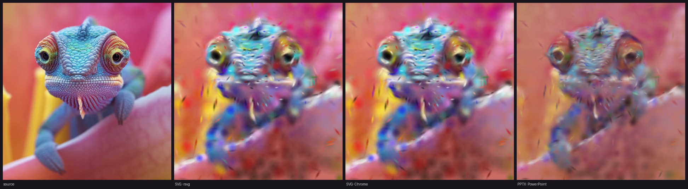

# Deployed-artifact fidelity by export format

> **`corpus/results.jsonl` is an append-only ledger of mixed eras — aggregate
> by `run_tag` and `schema_version`, never the whole file.** Pre-August rows
> mix four renderers (the 54 `rsvg-convert`, 42 `proxy-srgb` and 26
> `canvas-linear` rows predate the governing fields), and a statistic over
> everything blends governing evidence with proxies while looking uniform: a
> content-versus-fidelity correlation once came out at r=+0.456 that way,
> against +0.863 on governing rows alone. Filter on
> `is_deployed_artifact is True` and select an explicit `run_tag`.
>
> **The schema-v2 regeneration ran on 2026-08-02.** The SVG half is the 21
> fresh governing rows tagged `v2-governing-aug2026`: seed-0 populations
> retrained by the current code under the current defaults (including the
> corrected gate incumbent), captured in native-size Playwright Chromium,
> median LPIPS 0.2392 / SSIM 0.7509 — at the published expectations. The
> PowerPoint half is `powerpoint_results.jsonl`, fully regenerated: every
> deck re-emitted with the corrected-order default and captured from a real
> PowerPoint slideshow (median LPIPS 0.3200 / SSIM 0.6279, reproducing the
> order-study medians exactly). Captures are ICC-converted to sRGB since
> 2026-08-02 (`docs/pptx-colorspace.md`: macOS screenshots record Display
> P3, which previously desaturated every scored primary). Artifacts and
> captures are on disk under `corpus/runs/` again, with the July decks
> backed up as `*_july2026.*`.
> Reproduce with `tools/corpus_benchmark.py --run --formats svg --seeds 0
> --run-tag <tag>`, then the attended `tools/run_powerpoint_pass.py` followed
> by `tools/corpus_benchmark.py --score-powerpoint`.

> **Historical snapshot.** The 2026-07-31 governing-browser pass supersedes
> this document's earlier claim that librsvg is a safe stand-in for Chrome.
> On the later Chameleon portfolio winner, librsvg reported 0.7618 SSIM while
> Chrome reported 0.7193. Browser-delivered SVG must therefore be captured in
> Playwright Chromium; the measurements below remain historical evidence only.

Measured 2026-07-29 · chameleon (`docs/demo/source.png`, 476×502) · seed 42 ·
default `max-fidelity` profile · MLX backend.

Every number here comes from the **artifact a viewer actually opens** —
the emitted SVG put through a rasterizer, and the PPTX rendered by **real
PowerPoint** — never from the internal renderer.

| Format | Renderer | LPIPS ↓ | SSIM (sRGB) | PSNR (sRGB) | Size |
|---|---|---:|---:|---:|---:|
| SVG | rsvg-convert | 0.4151 | 0.7011 | 21.21 dB | 962 KB |
| SVG | Chrome | 0.4152 | 0.6967 | 21.22 dB | 962 KB |
| **PPTX** | **PowerPoint** | **0.4059** | **0.7342** | 19.78 dB | **156 KB** |



## What this shows

**1. PPTX beats SVG perceptually, at 1/6 the size.** Better LPIPS and SSIM
while *losing* on PSNR — the pixel-error-vs-perceptual split that recurs
throughout this project, where the perceptual metric is the one that tracks
what the eye sees. The likely cause is format-aware training: `--format pptx`
fits PowerPoint's compositor during optimization rather than converting to it
afterwards. It costs ~2.3× the wall clock (192 s vs 82 s).

**2. This particular SVG happened to agree across two renderers.** Chrome and
rsvg-convert agreed to four decimal places on LPIPS for this artifact. Later
artifacts did not preserve that agreement, so this observation cannot justify
using `rsvg-convert` as a browser-rendering stand-in.

## Post-processing with svgo

A `chameleon optim.svg` optimized at **precision 1** was measured against the
emitted original. It is not lossless:

| variant | LPIPS | Δ | SSIM | raw | gz |
|---|---:|---:|---:|---:|---:|
| ours | 0.4151 | — | 0.7011 | 962 K | 79 K |
| precision 1 | 0.4214 | **+0.0063** | 0.6930 | 853 K | 66 K |
| **precision 2** | **0.4151** | **±0.0000** | **0.7011** | 816 K | 75 K |

At precision 1 the stop-opacity vocabulary collapses from **64 distinct values
to 7**, **1760 stops snap to fully transparent** (up from 422 — Gaussian tails
truncated), and rotation pivots round to integers, displacing every rotated
splat by up to half a pixel. Geometry, rotations and all 1750 gradients
survive; the ellipse→circle rewrite and `rgb()`→hex are exact.

Precision 2 is free — identical LPIPS/SSIM to four decimals, **15.2% smaller**
— and is available as `--svg-optimize` (see `--svg-optimize-precision`).
Precision 1 only wins on the wire (66 K vs 75 K gzipped); that 9 KB costs
0.0063 LPIPS, which is at the edge of the ±0.005 run-to-run noise.

## Caveat

`README.md`'s quality table reports the opposite ordering (SVG ≈ 0.32 LPIPS,
PPTX ≈ 0.40). That table comes from a much longer run
(`--stages 1000,500,250`); these numbers are the default profile. Both can be
true — heavy training may favour SVG. Do not treat either as superseding the
other without matching the configurations.

This is also a best-effort-per-format comparison, not one splat set exported
two ways: each format trains against its own export target, which is what a
user actually gets per format.

## Contents

```
comparison.jpg        source | SVG(rsvg) | SVG(Chrome) | PPTX(PowerPoint)
results.json          machine-readable metrics + config + commit
renders/              the four 476×502 images compared above
artifacts/
  chameleon.pptx      156 KB, 1828 native DrawingML shapes, openxml-audit clean
  chameleon.svg       962 KB
  powerpoint_screen_capture.png   raw 3164×2024 PowerPoint slideshow capture
```

`chameleon.svg` (962 KB) and `powerpoint_screen_capture.png` (4.4 MB) are
generated locally and not committed — both are reproducible with the commands
below. Everything else here is tracked.

## Regenerating

```bash
splatthis docs/demo/source.png -o out.svg  --seed 42                  # ~82 s
splatthis docs/demo/source.png -o out.pptx --seed 42 --format pptx    # ~192 s
```

Score the SVG with `rsvg-convert`/cairosvg. The PPTX capture uses the
real-PowerPoint tooling in `../svg2ooxml/tools/ppt_research/`:

```bash
python -m tools.ppt_research.powerpoint_capture_cli deck.pptx out.png \
  --mode slideshow --delay 6 --slideshow-delay 5
```

**Never validate PPTX with soffice/LibreOffice** — it has a known rendering
bug for these shapes. Structure is checked with `openxml-audit`; the same
checks run natively in `tests/unit/test_pptx_package_validity.py`.
